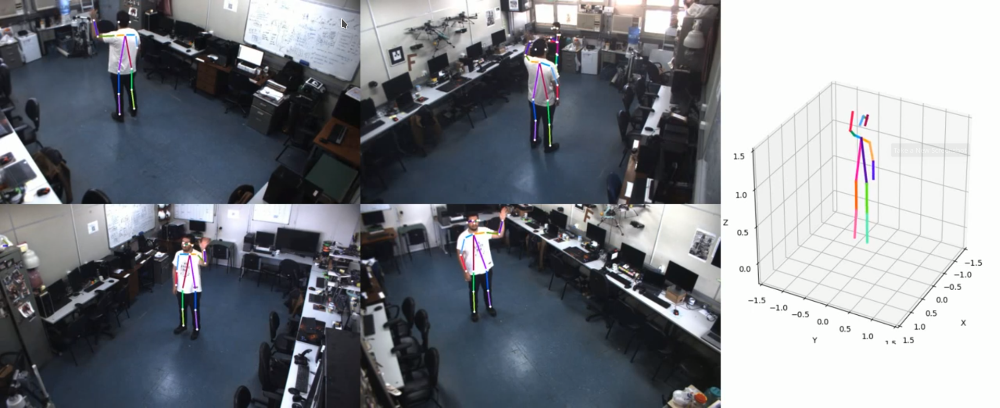

# Skeletons 3D Service

This service creates a 3d graphic using the skeletons localizations.

## Streams

| Name | Input (Topic/Message) | Output (Topic/Message) | Description | 
| ---- | --------------------- | ---------------------- | ----------- |
| Skeletons3d.Render | **SkeletonsGrouper.(GROUP_ID).Localization** [ObjectAnnotations] | **Skeletons3d.(GROUP_ID).Rendered** [Image] | Uses localizations published by [SkeletonsGrouper](https://github.com/labviros/is-skeletons-grouper) service to create an image with a 3d plot.

[Image]: https://github.com/labviros/is-msgs/blob/modern-cmake/docs/README.md#is.vision.Image
[ObjectAnnotations]: https://github.com/labviros/is-msgs/tree/v1.1.8/docs#is.vision.ObjectAnnotations

## About

This services create a [matplotlib figure](https://matplotlib.org/api/_as_gen/matplotlib.pyplot.figure.html) using the skeletons provided by the service [is-skeletons-grouper](https://github.com/labviros/is-skeletons-grouper) for plotting the skeletons in 3D, converts to an image and publish in a specific topic. **It only publish the 3D plot**.

For a demo experiment to understand the purpose of this application, watch the video on [youtube](https://www.youtube.com/watch?v=aZgmh9NsfWo). 

It is important to remember that for this service work as expected, it depends on the following other services:
* [is-cameras](https://github.com/labviros/is-cameras)
* [is-skeletons-detector](https://github.com/labviros/is-skeletons-detector)
* [is-frame-transformation](https://github.com/labviros/is-frame-transformation)
* [is-skeletons-grouper](https://github.com/labviros/is-skeletons-grouper)

## Service Configuration

Visit the [configuration file](src/conf/options.proto) to see all available parameters used to configure this service.

